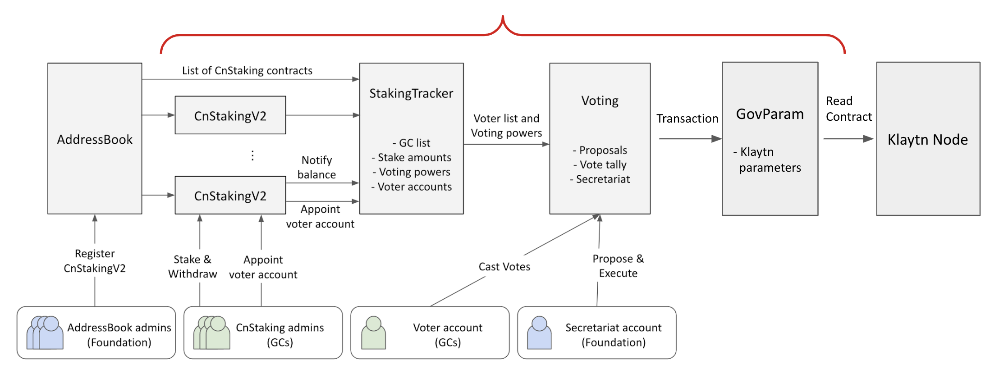

# Klaytn governance contracts (WIP)

## Audit scope

- CnStakingV2
- StakingTracker
- Voting
- GovParam

## Not scope

- legacy/AddressBook
- legacy/CnStakingContract (a.k.a. CnStakingV1)
- legacy/KlaytnReward
- legacy/SafeMath

## Resources

- [KIP-81](https://github.com/yeri-lee/kips/blob/master/KIPs/kip-81.md)
