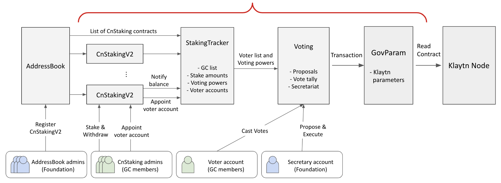

# Overview

The Klaytn contract-based governance voting will be conducted on smart contracts. Several contracts and accounts interact together in the process. The below diagram shows the relationship between contracts and accounts.

**List of contracts**

- **AddressBook**: an existing contract that stores the list of GC nodes, their staking contracts, and their reward recipient addresses. See [abook.md](./abook.md)
- **CnStakingContract**: an existing contract where GC members stake their KLAYs to earn rights to validate blocks. Code is at [legacy/CnStakingContract.sol](../contracts/legacy/CnStakingContract.sol)
- **CnStakingV2**: an updated version of the existing CnStakingContract. GC members stake their KLAYs to earn rights to validate blocks and cast on-chain votes. See [cns.md](./cns.md)
- **StakingTracker**: a new contract that tracks voting-related data from AddressBook and CnStakingV2 contracts.
- **Voting**: a new contract that processes the on-chain voting. It stores governance proposals, counts votes, and sends approved transactions. See [voting.md](./voting.md)
- **GovParam**: a new contract that stores Klaytn governance parameters such as block minting amount. The Klaytn node shall read this contract and use the parameters in block processing.

**List of accounts**

- **AddressBook admins**: a set of accounts controlled by Klaytn Foundation which can manage the list of GCs in the AddressBook. AddressBook admins are managed in the AddressBook contract.
- **CnStaking admins**: a set of accounts controlled by each GC member that can manage the staked KLAYs and its voter account. CnStaking admins are managed in the respective CnStakingV2 contracts. Note that every CnStakingV2 contract has a different set of admins.
- **Voter account**: an account controlled by each GC member that can cast on-chain votes. But this account cannot withdraw KLAYs from CnStakingV2 contracts. A Voter account is appointed at CnStakingV2 contracts of the respective GC member.
- **Secretary account**: an account controlled by Klaytn Foundation which can propose and execute on-chain governance proposals. The secretary account is managed in the Voting contract.

## Upgrade manual

It may become necessary to upgrade or replace one of the contracts due to bugfix, new feature, or lost admin account. Because the contracts are interlinked, upgrading one of them must be carefully done.

See [upgrade tests](../test/scenario_replace.js) for details.

